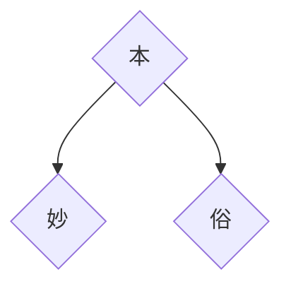

# 精妙还自本源来

在省常中的分享

2024.1.8

<!--
开场白

大家好，很荣幸受杜老师的邀请

如果把我今天的讲稿当成一片作文，我之前一直在想，是一篇议论文还是记叙文。

也就是说，是给你们讲故事，还是给你们讲道理。

后来我问了一个大二的同学，我说如果你是高中，你最想知道什么
-->

---

# 如何学好物理（误）？

  

  

<!--
可以看到其实别人的经验方法

并不一定适合自己，

甚至可能天差地别

不要盲目模仿

要能从别人身上找到自己要学习的地方

所以我今天就避免讲一些抽象的，属于我自己的方法论

我更多的和你们讲讲我的故事。

至于你从我的故事里听到了什么，那就是每个人有每个人不同的理解。

所以也希望大家多多互动交流，把你个人最希望了解的东西问出来，这个看你们的本事。
-->

---
layout: center
---

# 免责声明

今天我说的所有内容中，任何与你的老师教给你的知识有冲突的地方

  
**【请务必以老师为准】**

---
layout: cover
---

# 精妙还自本源来

回到这个题目
---

# 先看一道题

阅读下面的材料，根据要求写作。（60分）

“_**本手、妙手、俗手**_”是围棋的三个术语。本手是指合乎棋理的正规下法；妙手是指出人意料的精妙下法；俗手是指貌似合理，而从全局看通常会受损的下法。对于初学者而言，应该从本手开始，本手的功夫扎实了，棋力才会提高。一些初学者热衷于追求妙手，而忽视更为常用的本手。本手是基础，妙手是创造。一般来说，对本手理解深刻，才可能出现妙手；否则，难免下出俗手，水平也不易提升。

以上材料对我们颇具启示意义。请结合材料写一篇文章，体现你的感悟与思考。

要求：选准角度，确定立意，明确文体，自拟标题；不要套作，不得抄袭；不得泄露个人信息；不少于800字。

<!--
提问：

写过吗
- 来分享一下你是怎么写的
- 来说说你对审题的理解
-->

---

# 再看一篇作文

<iframe class="h-110 mx-auto" src="/花宇清-精妙还自本原来.pdf" height="100%" width="100%"></iframe>

<!--
把花的作文贴上来
-->
---

# 思考一个道理

---

# 再来看个视频

<iframe src="//player.bilibili.com/player.html?aid=880835592&bvid=BV1wK4y167zW&cid=1395652170&p=1" scrolling="no" border="0" frameborder="no" framespacing="0" allowfullscreen="true" class="w-200 h-100 mx-auto"> </iframe>

<!--
这里放和书法有关的视频
讲述临帖与不临帖的区别
-->

---

# 再来个本地视频
<video class="h-100 mx-auto" controls='controls'>
  <source src="/对比.mp4" type="video/mp4" />
</video>

---

# 理科学习

<!--
知识体系的构建
向优秀学习
三省吾身
-->
