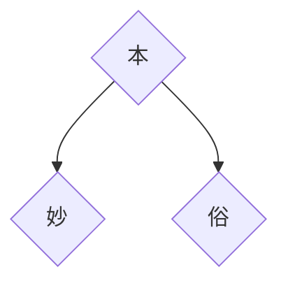
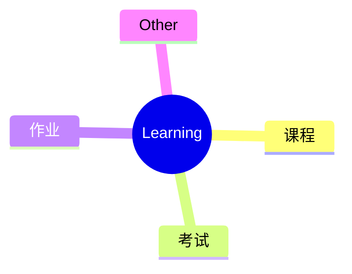
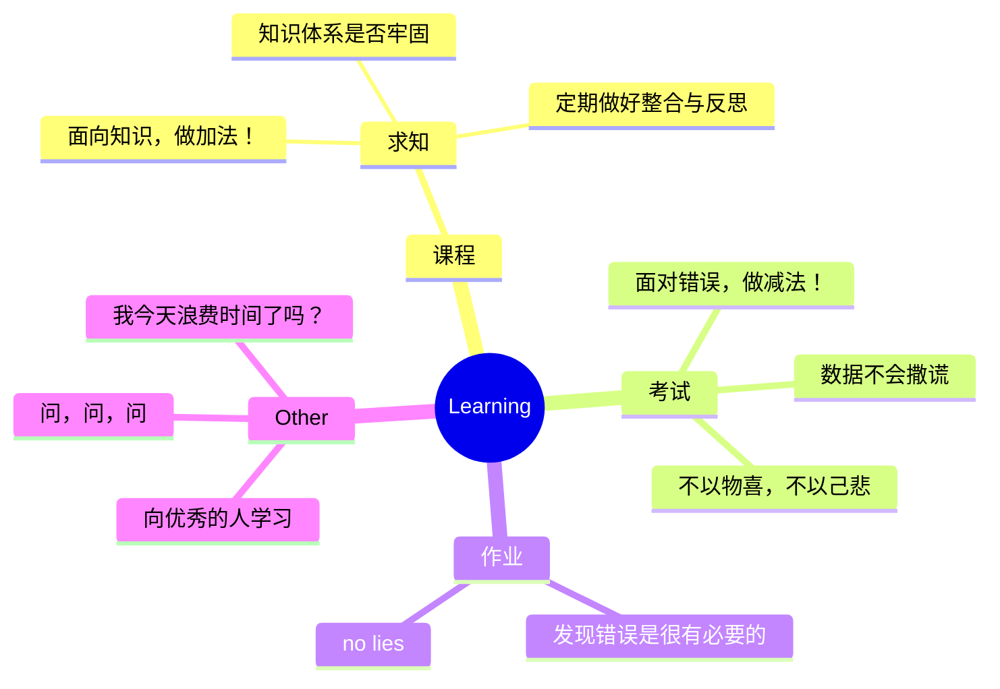

# 『根之茂者其实遂』

在省常中高一3班的分享

南京大学 曹信

2024.1.8

<!--
开场白

大家好，很荣幸受杜老师的邀请

如果把我今天的讲稿当成一片作文，我之前一直在想，是一篇议论文还是记叙文。

也就是说，是给你们讲故事，还是给你们讲道理。

后来我问了一个大二的同学，我说如果你是高中，你最想知道什么
-->
<!---~~~~~~~~~~~~~~~~~~~~~~~~~~~~~~~~~~~~~~~~~~~~~~~~~~~~~~~~~~~~~~~~~~~~~~~~--->

<!--
-~~~~~~~~~~~~~~~~~~~~~~~-
-->

---
layout:fact
---

# 如何学好物理（误）？

  

  

<!--
可以看到其实别人的经验方法

并不一定适合自己，

甚至可能天差地别

不要盲目模仿

要能从别人身上找到自己要学习的地方

所以我今天就避免讲一些抽象的，属于我自己的方法论

我更多的和你们讲讲我的故事，我的理解。

至于你从我的故事里听到了什么，那就是每个人有每个人不同的理解。

所以也希望大家多多互动交流，把你个人最希望了解的东西问出来，这个看你们的本事。
-->
<!---~~~~~~~~~~~~~~~~~~~~~~~~~~~~~~~~~~~~~~~~~~~~~~~~~~~~~~~~~~~~~~~~~~~~~~~~--->

<!---~~~~~~~~~~~~~~~~--->
---
layout: statement
---

# 免责声明

今天我说的所有内容中，任何与你的老师教给你的知识有冲突的地方

**「请务必以老师为准」**

<!---~~~~~~~~~~~~~~~~~~~~~~~~~~~~~~~~~~~~~~~~~~~~~~~~~~~~~~~~~~~~~~~~~~~~~~~~--->

<!--
-~~~~~~~~~~~~~~~~-
-->

---
layout: fact
---

# 根之茂者其实遂

回到这个题目
<!---~~~~~~~~~~~~~~~~~~~~~~~~~~~~~~~~~~~~~~~~~~~~~~~~~~~~~~~~~~~~~~~~~~~~~~~~--->

<!---~~~~~~~~~~~~~~~~--->
---
layout：default
---

# 来点高考记忆

阅读下面的材料，根据要求写作。（60分）

“_**本手、妙手、俗手**_”是围棋的三个术语。本手是指合乎棋理的正规下法；妙手是指出人意料的精妙下法；俗手是指貌似合理，而从全局看通常会受损的下法。对于初学者而言，应该从本手开始，本手的功夫扎实了，棋力才会提高。一些初学者热衷于追求妙手，而忽视更为常用的本手。本手是基础，妙手是创造。一般来说，对本手理解深刻，才可能出现妙手；否则，难免下出俗手，水平也不易提升。

以上材料对我们颇具启示意义。请结合材料写一篇文章，体现你的感悟与思考。

要求：选准角度，确定立意，明确文体，自拟标题；不要套作，不得抄袭；不得泄露个人信息；不少于800字。

<!--
提问：

写过吗
- 来分享一下你是怎么写的
- 来说说你对审题的理解
-->
<!---~~~~~~~~~~~~~~~~~~~~~~~~~~~~~~~~~~~~~~~~~~~~~~~~~~~~~~~~~~~~~~~~~~~~~~~~--->

<!---~~~~~~~~~~~~~~~~--->
---
layout: default
---

# 一篇范文

<iframe class="h-110 mx-auto" src="/花宇清-精妙还自本原来.pdf" height="100%" width="100%"></iframe>

<!--
把花的作文贴上来

59
-->
<!---~~~~~~~~~~~~~~~~~~~~~~~~~~~~~~~~~~~~~~~~~~~~~~~~~~~~~~~~~~~~~~~~~~~~~~~~--->

<!---~~~~~~~~~~~~~~~~--->
---
layout: statement
---

# 说说你的理解

<!---~~~~~~~~~~~~~~~~~~~~~~~~~~~~~~~~~~~~~~~~~~~~~~~~~~~~~~~~~~~~~~~~~~~~~~~~--->

<!--
-~~~~~~~~~~~~~~~~-
-->

---
layout: default
---

# 一个例子

<iframe src="//player.bilibili.com/player.html?aid=570453821&bvid=BV11z4y1a7V1&cid=1108086152&p=1" scrolling="no" border="0" frameborder="no" framespacing="0" allowfullscreen="true" class="w-200 h-100 mx-auto"> </iframe>

<!--
这里放和书法有关的视频
讲述临帖与不临帖的区别

大家来看属于妙还是本还是俗

- 纯粹的炫技，炫的很拙劣

根写作文华丽辞藻堆砌一样，但是却跑题了
没有内在逻辑，整个作文也没有中心思想

那么，什么是本手呢？
临帖：取法乎上
沉淀：时间积累
不破不立

妙：
-->
<!---~~~~~~~~~~~~~~~~~~~~~~~~~~~~~~~~~~~~~~~~~~~~~~~~~~~~~~~~~~~~~~~~~~~~~~~~--->

<!---~~~~~~~~~~~~~~~~--->
---
layout: default
---

# 本手 $\rightarrow$ 妙手

<video class="h-100 mx-auto" controls='controls'>
  <source src="https://box.nju.edu.cn/f/8c4ee1757905494f9745/?dl=1" type="video/mp4" />
</video>
<!--
书法博士
https://www.bilibili.com/video/BV19B4y1W7ck/?spm_id_from=333.337.search-card.all.click&vd_source=9fc1aeab20d64d4315c451b9c18d30d8
-->
<!---~~~~~~~~~~~~~~~~~~~~~~~~~~~~~~~~~~~~~~~~~~~~~~~~~~~~~~~~~~~~~~~~~~~~~~~~--->

<!---~~~~~~~~~~~~~~~~--->
---
layout: default
---

# 又一个例子
<video class="h-100 mx-auto" controls='controls'>
  <source src="/对比.mp4" type="video/mp4" />
</video>
<!--
这个也是俗的，我模仿这个人，你感觉好像模仿的差不多，KaoruNakamura有一个明显的滞空感
有的裁判可能就不算我得分
那么在裁判打表演分的时候，里面有一项是，线球操控，这部分分数就会没有
-->

<!---~~~~~~~~~~~~~~~~~~~~~~~~~~~~~~~~~~~~~~~~~~~~~~~~~~~~~~~~~~~~~~~~~~~~~~~~--->

<!---~~~~~~~~~~~~~~~~--->
---
layout: default
---

# 又一个本手 $\rightarrow$ 妙手

<video class="h-100 mx-auto" controls='controls'>
  <source src="https://box.nju.edu.cn/f/6c57860630bd4d90bd03/?dl=1" type="video/mp4" />
</video>
<!--
https://www.bilibili.com/video/BV1P94y147YK/?spm_id_from=333.337.search-card.all.click&vd_source=9fc1aeab20d64d4315c451b9c18d30d8
其实你看我说的这个评论就应该能猜到为啥了。17-19年他越来越强，中国冠军都是他的，还拿到了19年亚洲第四，这成绩可以说从08年以后无人出其右了。但是在19年世界赛，大翻车导致决赛垫底，这个事情给他留下不小的心理阴影。之后他又患上了米尼尔综合症（他本人很久之前就有过耳鸣的情况，这东西不仅是生理上的痛苦，心里压力也特别大的），学业上考研也失利了。生活上和比赛上给了他不少打击，也让他沉寂了好几年，直到去年年底才复出，今年才回归赛场，这次世界赛他上场一直在做噤声的动作也能看出他内心也是很紧张彷徨的，一直到这次决赛成功发挥后才算彻底走出阴影，所以结束后他才这么激动
-->
<!---~~~~~~~~~~~~~~~~~~~~~~~~~~~~~~~~~~~~~~~~~~~~~~~~~~~~~~~~~~~~~~~~~~~~~~~~--->

<!---~~~~~~~~~~~~~~~~--->
---
layout: intro
---

# 一些感悟

- 不破不立
- 取法乎上
- 时间沉淀是必要的
- 细节是区分俗和妙的关键

<!-- 解释：
不破不立，3000次，经常就是吃个饭动作就忘了，又得重学
还有就是，能做出来，但是怎么做都没他好看，这时候就需要抉择，是就这么做下去，号称是我自己的风格
第二是说明，我路子走错了。还是深挖关键问题，摈弃已经付出的时间和代价，从头来过。

取法乎上的意思就是，学东西要学最上游的，最上游的最接近原理。
这个其实涉及到问题就是，什么是真正的本手。刚才说的是主观态度，就是我要去务实基础，不能眼高手低，最后变成俗手
那什么才是真正的基础的东西，是我要去花很大很大精力去维护的，踏实不能踏了个假的实，踏成虚了
这个我在后面会讲到

时间沉淀是比要的：
10天连续做300次的事情，是不能通过一天猛做三千次来达成的 补作业？

细节，可能外人看来差不多，但其实是失之毫厘谬以千里的关系。随着时间的推移，劣势会慢慢慢慢放大。
-->
<!---~~~~~~~~~~~~~~~~~~~~~~~~~~~~~~~~~~~~~~~~~~~~~~~~~~~~~~~~~~~~~~~~~~~~~~~~--->

<!---~~~~~~~~~~~~~~~~--->
---
layout: statement
---

# 讨论：你有类似的感悟吗

<!-- 生活中的例子，音乐，
学习中的例子呢
 -->

<!---~~~~~~~~~~~~~~~~~~~~~~~~~~~~~~~~~~~~~~~~~~~~~~~~~~~~~~~~~~~~~~~~~~~~~~~~--->

<!---~~~~~~~~~~~~~~~~--->
---
layout: statement
---

# 什么样的学习，才算本手？

<!--
前置问题：为什么而学
考试的目的，是为了检验
作业的目的，是为了巩固
上课的目的，是求知
-->
<!---~~~~~~~~~~~~~~~~~~~~~~~~~~~~~~~~~~~~~~~~~~~~~~~~~~~~~~~~~~~~~~~~~~~~~~~~--->

<!---~~~~~~~~~~~~~~~~-->
---
layout: default
class: text-center
---

# 黄金准则
我瞎说的

<!---~~~~~~~~~~~~~~~~~~~~~~~~~~~~~~~~~~~~~~~~~~~~~~~~~~~~~~~~~~~~~~~~~~~~~~~~--->

<!--
~~~~~~~~~~~~~~~~
-->

---
layout: intro
---

# 一些细节
物理数学的知识结构

上次考试的文言实词

上次考试的英语生词

你有几个笔记本？

分类的哲学

文件袋？

找出上一次大型考试的所有学科的试卷

回忆一下数学考试的一道大题，考察的是什么，合理的解法是什么？
<!---~~~~~~~~~~~~~~~~~~~~~~~~~~~~~~~~~~~~~~~~~~~~~~~~~~~~~~~~~~~~~~~~~~~~~~~~--->

<!--
-~~~~~~~~~~~~~~~~
-->

---
layout: default
---

# 几个故事
<!---~~~~~~~~~~~~~~~~~~~~~~~~~~~~~~~~~~~~~~~~~~~~~~~~~~~~~~~~~~~~~~~~~~~~~~~~--->

---
layout: default
---

# Q & A

<!-- 
什么样的学习，才算本手？（和理科学习合一起）
考试的目的，是为了检验
作业的目的，是为了巩固
上课的目的，是求知

列举一些现象，学习中的不务实，讨论
火柴人vs物理
敢问，问，问
黄金原则
对待知识，做加法，不要犹豫，有时间就去做
对待错误，做减法！
一次考试暴露出的问题，只要解决了，并保证不再犯，那就是
错因本

数据不会说谎，三省吾身

学习习惯，整合与反思的习惯
装备，能否清晰的找出一张试卷
take notes，分门别类，条理清晰，避免落入俗手，差生文具多
来点黄金准则
我今天，有浪费时间吗

自主学习，要回答一个问题，我为什么而学

看看之前的南创班PPT

几个故事

疫情前，上上下下

疫情后，稳步前进

疫情中，狠狠批评

理想境界：不以物喜

不务实的后果：全挂

什么样的学习，才算本手？

语文：答题框架是辅助，读懂文章是根本
无论是诗歌，文言文，还是什么。文言文那就更看基础了，

数学，概念，定义，数学思想
精妙的计算化简，精妙的辅助线，奇崛的解题思路，这些是不可求的

英语，请人来说说。

computer vs mobile

#  一万次不行，一百万次 -->

铁牛书记的话

多好的年纪，

再困难的时候

---
layout: iframe

url: /random.html
---